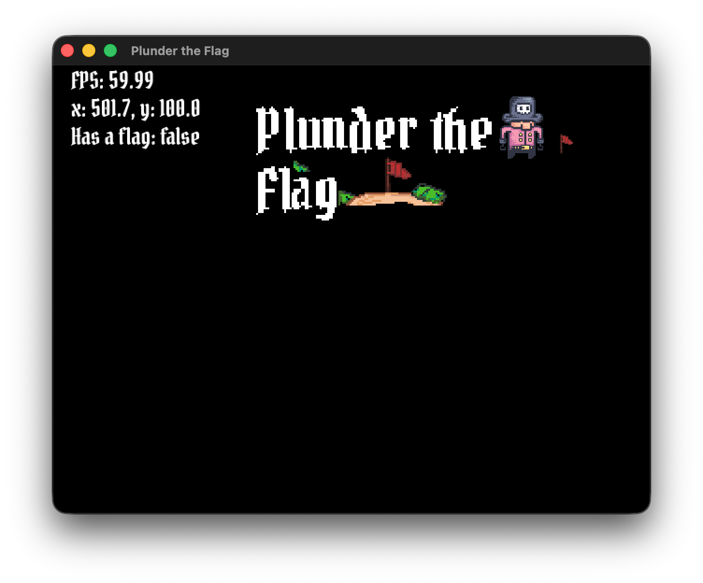

# Plunder the Flag

A game about trying to get through your enemy team and capture their flag whilst avoiding their bombs and other attacks.

## Game so far

> [!NOTE]
> This is picture and might be outdated
> It was taken at [commit 7d75429](https://github.com/Revi-Studios/plunder-the-flag/commit/7d75429)



## How do I install it?

Options:

- [Download source code, compile and run](#how-do-i-compile-it-myself)
- [Download a released binary](#how-do-i-download-a-release-and-run-it)

> [!NOTE]
> The released binary might not be updated to the newest version

### How do I compile it myself?

For this step you need to have installed:

- [Go Programming Language](https://go.dev/)

Next:

1. Clone the repository or Download and extract a zip with all the code
2. Open the folder with the code

```bash
cd path/to/project
```

3. Run:

```bash
go run .
```

This will compile and run the game directly

If you want to compile the project to a single binary run:

```bash
go build . -o game
```

This will compile the project to a binary called `game`

### How do I download a release and run it?

To run the binary you will have to use a terminal

1. Download [latest release](https://github.com/Revi-Studios/plunder-the-flag/releases) (binary)
2. Open your terminal at the folder you downloaded the binary in and run:

**macOS/Linux:**

```bash
chmod +x game
./game
```

**Windows**

```cmd
.\game.exe
```

> [!TIP]
> macOS Users: If you get a warning saying the developer cannot be verified, open your Mac's System Settings > Privacy & Security, scroll down to the Security section, and click Open Anyway.
